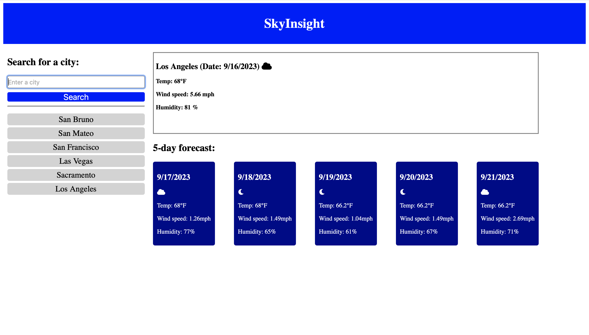

# SkyInsight

## Description

This website provides real-time weather updates for the city you've selected. I developed this platform as a personal project to enhance my skills in retrieving data from APIs and presenting it on a website. To achieve this, I utilized the OpenWeather API to access and display accurate weather conditions. While developing this website, I gained valuable experience in effectively retrieving data from the API. Handling the current weather data proved to be straightforward, but presenting the 5-day forecast posed a more complex challenge. To achieve the desired result, I employed a 'for' loop to collect data for the upcoming 5 days. However, this approach introduced an issue where dates and their associated weather conditions were duplicated multiple times. To address this problem, I implemented a crucial 'if' statement using a 'uniqueDates' object. This statement ensured that the data wouldn't replicate itself unnecessarily. By checking if a date had already been processed, I prevented duplicate entries in the forecast. Through the process of building this website and overcoming these challenges, I believe I've made significant improvements in my coding skills and problem-solving abilities.

https://raymond2811.github.io/SkyInsight/

## Usage

This website is designed for user-friendliness. To check the weather for a specific city, simply enter the city name. Wait just a moment, and you'll receive the weather information along with a weather icon. Additionally, you can revisit the weather conditions for cities in your search history by clicking on them.

## Credits

Josue Hernandez, https://github.com/JosueHernand

## License

MIT License